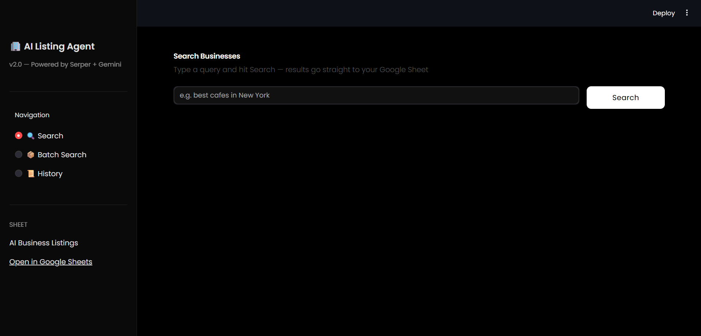
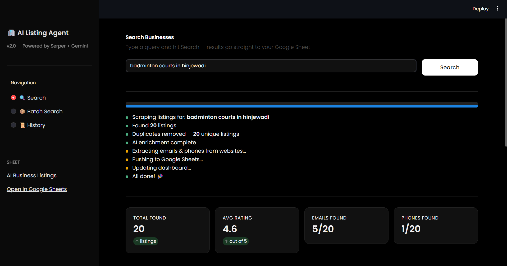
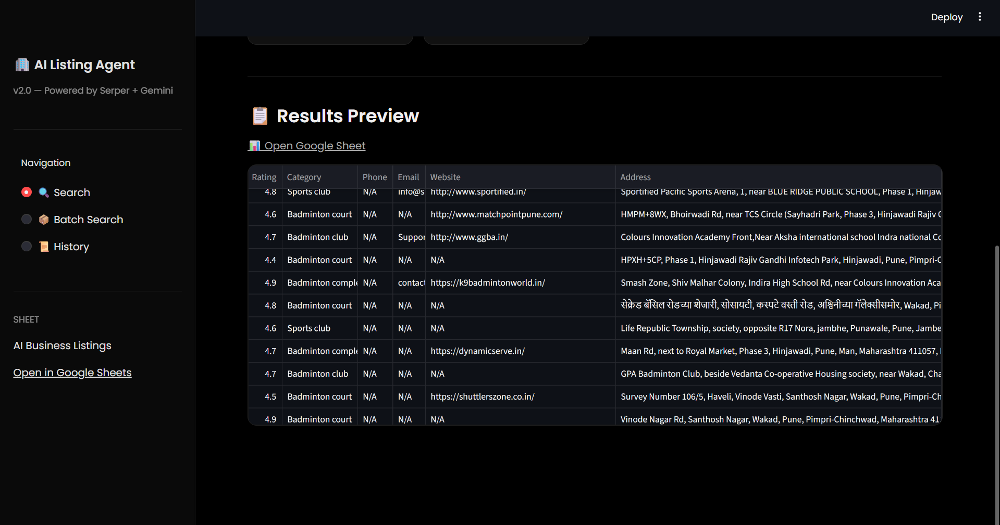
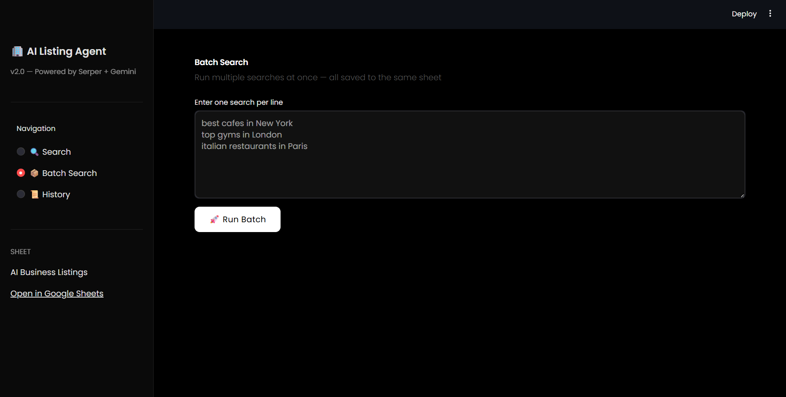
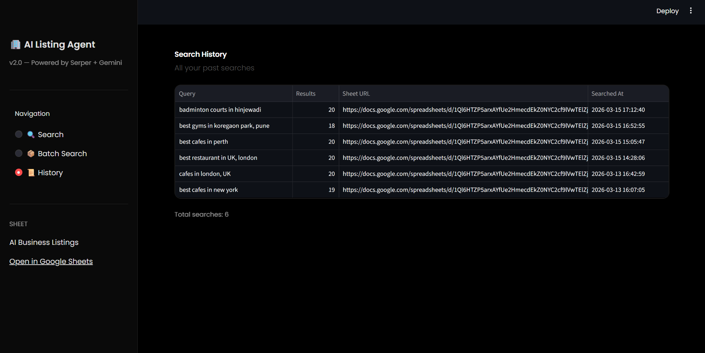
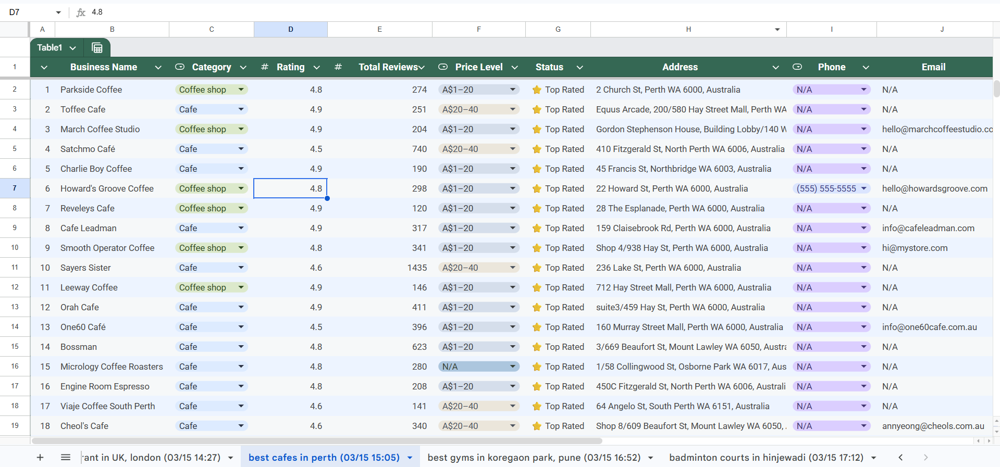

# 🏢 AI Business Listing Agent

> Scrape any business listings from Google Maps and push them straight to Google Sheets — powered by **Serper API**, **Gemini AI**, and a sleek **Streamlit UI**.

<br>

## 📸 Screenshots

> _Add your screenshots below by replacing the placeholder paths_

<br>

**🔍 Search Page**


<br>

**📊 Results with Metrics**



<br>

**📦 Batch Search**


<br>

**📜 Search History**


<br>

**📋 Google Sheets Output**


<br>

---

## ✨ Features

- 🔍 **Smart Scraping** — Pulls real business listings from Google Maps via Serper API
- 🧠 **AI Enrichment** — Gemini AI cleans, fixes typos, and fills missing categories
- 📧 **Email Extraction** — Automatically visits business websites to extract emails
- 📞 **Phone Extraction** — Scrapes phone numbers directly from business websites
- 🕐 **Opening Hours** — Captures full weekly opening hours for every listing
- 🧹 **Duplicate Removal** — Built-in deduplication before pushing to Sheets
- 📦 **Batch Search** — Queue multiple searches and run them all at once
- 📊 **Dashboard Tab** — Auto-generated summary tab in Google Sheets after every search
- 📜 **Search History** — Local JSON log of every search you've ever run
- 🎨 **Beautiful UI** — Sleek black Streamlit interface with Poppins font
- 💰 **100% Free** — Zero cost using free tiers of all APIs

<br>

---

## 🛠️ Tech Stack

| Layer | Tool | Purpose |
|---|---|---|
| 🖥️ Frontend | Streamlit | Web UI |
| 🤖 AI Brain | Google Gemini 2.0 Flash | Data enrichment |
| 🔍 Scraping | Serper API (`/maps`) | Google Maps data |
| 📊 Output | Google Sheets API | Store listings |
| 🧱 Orchestration | LangChain | AI agent framework |
| 🐍 Language | Python 3.11+ | Backend |

<br>

---

## 📁 Project Structure

```
ai-listing-agent/
├── app.py               # Streamlit frontend
├── main.py              # CLI entry point
├── agent.py             # Core AI agent logic
├── scraper.py           # Serper API scraping
├── sheets.py            # Google Sheets integration
├── email_extractor.py   # Email & phone extraction
├── dashboard.py         # Dashboard tab generator
├── batch.py             # Batch search handler
├── history.py           # Search history tracker
├── .env                 # API keys (never commit this!)
├── credentials.json     # Google service account (never commit!)
├── requirements.txt     # Python dependencies
└── search_history.json  # Auto-generated search log
```

<br>

---

## ⚙️ Setup & Installation

### 1. Clone the repo
```bash
git clone https://github.com/mansiggit/AI_Listing_Agent.git
cd ai-listing-agent
```

### 2. Create and activate virtual environment
```bash
python -m venv venv

# Windows
venv\Scripts\activate

# Mac/Linux
source venv/bin/activate
```

### 3. Install dependencies
```bash
pip install -r requirements.txt
```

### 4. Set up API Keys

Create a `.env` file in the root folder:
```env
SERPER_API_KEY=your_serper_key_here
GEMINI_API_KEY=your_gemini_key_here
SPREADSHEET_URL=your_google_sheet_url_here
```

| Key | Where to get it |
|---|---|
| `SERPER_API_KEY` | [serper.dev](https://serper.dev) — Free, 2500 searches/month |
| `GEMINI_API_KEY` | [aistudio.google.com](https://aistudio.google.com) — Free tier |
| `SPREADSHEET_URL` | Create a Google Sheet and copy its URL |

### 5. Set up Google Sheets API

1. Go to [Google Cloud Console](https://console.cloud.google.com)
2. Create a new project → Enable **Google Sheets API** + **Google Drive API**
3. Create a **Service Account** → Download JSON key → rename to `credentials.json`
4. Place `credentials.json` in the project root
5. Share your Google Sheet with the service account email (Editor access)

<br>

---

## 🚀 Running the App

### Streamlit Web UI (Recommended)
```bash
streamlit run app.py
```
Opens at `http://localhost:8501`

### CLI Mode
```bash
python main.py
```

<br>

---

## 🔍 How to Use

### Single Search
Type any query and hit **Search**:
```
best cafes in New York
top rated gyms in London
italian restaurants in Mumbai
coworking spaces in Bangalore
```

### Batch Search
Go to **Batch Search** → enter one query per line → hit **Run Batch**

### View History
Go to **History** to see all your past searches with timestamps and result counts

<br>

---

## 📊 Google Sheets Output

Each search creates a **new tab** in your Google Sheet with these columns:

| Column | Description |
|---|---|
| S.No | Serial number |
| Business Name | Name of the business |
| Category | Type of business |
| Rating | Google rating (out of 5) |
| Total Reviews | Number of reviews |
| Price Level | $ / $$ / $$$ / $$$$ |
| Status | ⭐ Top Rated / 👍 Well Rated / 😐 Average |
| Address | Full address |
| Phone | Extracted from website |
| Email | Extracted from website |
| Website | Business website URL |
| Opening Hours | Full weekly schedule |
| Open Now | ✅ Open / ❌ Closed |
| Scraped At | Timestamp of scrape |

A **📊 Dashboard** tab is also auto-generated with summary stats after every search.

<br>

---

## ☁️ Deploying to Streamlit Cloud (Free)

1. Push this repo to GitHub
2. Go to [share.streamlit.io](https://share.streamlit.io)
3. Connect your GitHub repo
4. Set main file as `app.py`
5. Add your secrets under **Advanced Settings**:
```toml
SERPER_API_KEY = "your_key"
GEMINI_API_KEY = "your_key"
SPREADSHEET_URL = "your_sheet_url"
```
6. Click **Deploy** — live in ~2 minutes! 🎉

<br>

---

## 🔒 Important — Security

Make sure these files are in your `.gitignore` before pushing:
```
.env
credentials.json
search_history.json
__pycache__/
venv/
*.pyc
```

<br>

---

## 💡 Roadmap / Future Features

- [ ] Export results as CSV directly from UI
- [ ] Filter & sort results in the UI before pushing to Sheets
- [ ] Schedule automatic searches (cron jobs)
- [ ] WhatsApp / Email notification when batch is done
- [ ] Support for multiple countries & languages
- [ ] Chrome Extension version

<br>

---

## 🙌 Acknowledgements

- [Serper API](https://serper.dev) — Google Search API
- [Google Gemini](https://aistudio.google.com) — AI enrichment
- [Streamlit](https://streamlit.io) — Web UI framework
- [gspread](https://github.com/burnash/gspread) — Google Sheets Python client
- [LangChain](https://langchain.com) — AI agent orchestration

<br>

---

<p align="center">Built with 🖤 by Mansi</p>
